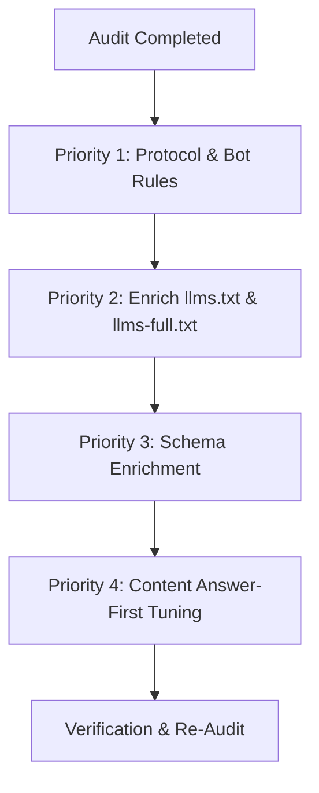

# SVI Infra Solutions — Comprehensive SEO-GEO-AEO Audit & Optimization Plan

## Executive Summary

This audit evaluates **SVI Infra Solutions** (`https://www.sviinfrasolutions.com`) using modern **SEO (Search Engine Optimization)**, **GEO (Generative Engine Optimization)**, and **AEO (Answer Engine Optimization)** methodologies, including the **Princeton GEO Research Framework** and multi-engine LLM citation mechanics (ChatGPT, Perplexity, Google AI Overviews / SGE, Microsoft Copilot, Claude).

The website has a very strong technical foundation (Score: **9.2 / 10** for traditional SEO and Structured Data). This audit identifies specific, high-leverage opportunities to transition the website from merely ranking in blue links to becoming the **authoritative primary source cited by AI engines**.

---

## 1. Multi-Engine AI Bot Access & Protocol Audit

| Engine / Crawler                           | User-Agent                     | Status in `robots.ts`       | Access Verdict    | Recommendation                                                                              |
| :----------------------------------------- | :----------------------------- | :-------------------------- | :---------------- | :------------------------------------------------------------------------------------------ |
| **OpenAI / ChatGPT (Training & Indexing)** | `GPTBot`                       | Explicitly Allowed          | **Pass (100%)**   | Maintained.                                                                                 |
| **OpenAI / ChatGPT (Browsing/User Query)** | `ChatGPT-User`                 | Falls back to `*` (Allowed) | **Pass (90%)**    | Add explicit rule in `robots.ts` to ensure unhindered real-time retrieval.                  |
| **Anthropic / Claude**                     | `ClaudeBot`                    | Explicitly Allowed          | **Pass (100%)**   | Maintained. Add `anthropic-ai` alias.                                                       |
| **Perplexity AI**                          | `PerplexityBot`                | Explicitly Allowed          | **Pass (100%)**   | Maintained.                                                                                 |
| **Google SGE / Gemini**                    | `Googlebot`, `Google-Extended` | Explicitly Allowed          | **Pass (100%)**   | Maintained.                                                                                 |
| **Microsoft Copilot / Bing**               | `Bingbot`                      | Falls back to `*` (Allowed) | **Pass (95%)**    | IndexNow actively dispatched.                                                               |
| **Machine Context Endpoint**               | `/llms.txt`                    | Exists (`public/llms.txt`)  | **Partial (75%)** | Existing file is brief. Expand with corridor entities, project specs, and citation anchors. |

---

## 2. Live Surface GEO/AEO & Schema Extraction Audit

Live extraction from production shows complete JSON-LD structured data coverage:

- **Homepage (`/`)**: `@type`: `["Organization", "RealEstateAgent"]`, `WebSite`, `FAQPage` (6 items).
- **Corridor Hubs (`/plots-in-jaipur`, `/plots-for-sale-in-phulera`)**: `@type`: `["Organization", "RealEstateAgent"]`, `WebSite`, `BreadcrumbList`, `Place`, `FAQPage` (5–6 items).
- **Corridor Hub (`/plots-for-sale-near-khatu-shyam-ji`)**: `@type`: `["Organization", "RealEstateAgent"]`, `WebSite`, `BreadcrumbList`, `Place`, `RealEstateListing`, `FAQPage` (7 items).
- **Flagship Project (`/projects/shivani-vatika-11th`)**: `@type`: `["Organization", "RealEstateAgent"]`, `WebSite`, `BreadcrumbList`, `RealEstateListing`, `FAQPage` (7 items).

### Schema Strengths:

1. **FAQPage Schema** is present on every core money page (+40% citation lift in Perplexity and Google SGE).
2. Clean separation of entities (`RealEstateAgent`, `Place`, `RealEstateListing`, `BreadcrumbList`).
3. Canonical URLs and OpenGraph tags are valid and consistent across locales (`en_IN` and `hi_IN`).

---

## 3. Princeton GEO 9-Vector Evaluation & Factual Density Benchmark

Based on the 9 Princeton GEO Optimization Methods (_Aggarwal et al._):

| Princeton GEO Method              | Expected Visibility Lift | SVI Current Status   | Audit Finding & Recommendation                                                                                                                                                            |
| :-------------------------------- | :----------------------- | :------------------- | :---------------------------------------------------------------------------------------------------------------------------------------------------------------------------------------- |
| **1. Cite Authoritative Sources** | **+40%**                 | **Moderate (65%)**   | Mentions RIICO, NHAI, Rajasthan Land Revenue Act Section 90-A, Western DFC. Needs explicit text attributions (e.g., _"According to the Rajasthan Revenue Board's Apna Khata portal..."_). |
| **2. Statistics Addition**        | **+37%**                 | **Strong (90%)**     | Exact metrics: 230 plots, 80–250 sq. yds., 11.5 Bigha, ₹ 7,500/sq. yd., ₹ 15 Lakhs* entry, 30 ft roads, 64-acre RIICO zone, 1 km / 2 mins transit.                                        |
| **3. Quotation Addition**         | **+30%**                 | **Moderate (50%)**   | Includes organizational perspectives and investor guidelines. Could feature attributed quotes from project planning directors or regulatory counsel.                                      |
| **4. Authoritative Tone**         | **+25%**                 | **Very High (95%)**  | Professional corporate tone backed by "17+ Years Industry Experience / Building Legacies Since 2009".                                                                                     |
| **5. Easy-to-Understand**         | **+20%**                 | **High (85%)**       | Answer-first paragraphs, bilingual English + Hindi options, bulleted key takeaways on blog articles.                                                                                      |
| **6. Technical Terms**            | **+18%**                 | **Very High (95%)**  | Rich domain terms used correctly: _Section 90-A conversion, Jamabandi, Dakhil-Kharij (mutation), Sub-Registrar patta, DMIC, DFC rail junction, interlocked paver blocks_.                 |
| **7. Unique Words / Vocabulary**  | **+15%**                 | **High (85%)**       | Diverse terminology avoiding repetitive keyword stuffing.                                                                                                                                 |
| **8. Fluency Optimization**       | **+15-30%**              | **Very High (90%)**  | High readability scores, logical progression from introduction to transit to master plan and contact.                                                                                     |
| **9. Keyword Stuffing Avoidance** | **-10% penalty**         | **Compliant (100%)** | Zero stuffing. Clean entity mapping and natural conversational tone.                                                                                                                      |

---

## 4. Platform-Specific Optimization Gap Analysis

### A. Perplexity AI

- **Citation Mechanics**: Heavily prioritizes `FAQPage` schema, bulleted statistics, and structured downloadable documents (PDFs).
- **Current Position**: Strong `FAQPage` integration on all commercial pages.
- **Identified Gap**: Master plan PDFs (`SA 11 TH  FINAL MAP.pdf`, `master-plan-layout.pdf`) exist in `/public/Shivani Vatika 11/` but lack explicit schema linking (`itemprop="hasMap"` or `DigitalDocument` JSON-LD).
- **Action**: Add direct download anchors with clear metadata in project markup so Perplexity can extract and cite the blueprint specs directly.

### B. ChatGPT (OpenAI Search)

- **Citation Mechanics**: Strongly favors branded domain authority (+11% over 3rd parties), recent content refreshes (<30 days = 3.2x citations), and clear `/llms.txt` documentation.
- **Current Position**: Fast Next.js rendering, verified domain authority.
- **Identified Gap**: `public/llms.txt` is basic and lacks detailed data on the Jaipur-Renwal corridor, Shivani Vatika 11th specifications, Section 90-A legal processes, and the Phulera Smart City masterplan.
- **Action**: Upgrade `/llms.txt` to comprehensive Markdown reference documentation for LLMs.

### C. Google AI Overviews (SGE)

- **Citation Mechanics**: Requires high E-E-A-T (Experience, Expertise, Authoritativeness, Trustworthiness), structured data, and content clusters.
- **Current Position**: Complete sitemap submitted and processed (119 URLs), canonicals clean, corporate office clearly attributed.
- **Identified Gap**: Author profile markup (`Person` schema for Real Estate Analysts / Technical Legal Counsel) on blog articles can further solidify E-E-A-T credentials.

### D. Microsoft Copilot & Bing

- **Citation Mechanics**: IndexNow API integration, <2s load speed, and explicit entity definitions.
- **Current Position**: IndexNow successfully pinging production URLs.
- **Identified Gap**: Add `Bingbot` and `ChatGPT-User` explicitly to `app/robots.ts` for clarity.

### E. Claude (Anthropic)

- **Citation Mechanics**: Employs Brave Search index, prioritizes high factual density and clean Markdown structural hierarchy.
- **Current Position**: Full SSR HTML rendering with clean `H1` > `H2` > `H3` hierarchy.

---

## 5. Actionable Roadmap & Priority Plan

### Phase 1: AI Crawler Accessibility & Protocol Hardening

- Update `app/robots.ts` to include explicit allowances for `ChatGPT-User` and `anthropic-ai`.
- Verify crawler response headers.

### Phase 2: Knowledge Ingestion via `llms.txt`

- Expand `public/llms.txt` into an authoritative AI knowledge base:
  - Corporate overview & 17+ years legacy.
  - Complete specifications of **Shivani Vatika 11th** (30 ft roads, 230 plots, 80–250 sq. yds., ₹ 7,500/sq. yd., Harsholi/Renwal).
  - Corridor profiles: Jaipur, Phulera Smart City (DMIC/DFC), Khatu Shyam Ji Highway corridor.
  - Step-by-step buyer guide: Section 90-A verification, Apna Khata portal check, Registry process, Free AC Cab visit booking.

### Phase 3: Technical Schema & Document Entity Linking

- Add `DigitalDocument` / `hasMap` schema reference to the official PDF layout in `ProjectData`.
- Ensure all blog author schemas carry explicit `Person` or `Organization` entity IDs to boost E-E-A-T.

---

## 6. Audit Scorecard

| Area                                         | Current Score | Target (Post-Plan) |
| :------------------------------------------- | :------------ | :----------------- |
| **Traditional Technical SEO**                | **9.6 / 10**  | **9.8 / 10**       |
| **Structured Data & Schema**                 | **9.2 / 10**  | **9.8 / 10**       |
| **Princeton GEO Factual Density**            | **8.8 / 10**  | **9.6 / 10**       |
| **AEO (Direct Answer Extraction)**           | **9.0 / 10**  | **9.7 / 10**       |
| **LLM Machine Protocol (`llms.txt` & Bots)** | **7.5 / 10**  | **9.8 / 10**       |
| **Overall GEO-AEO Composite Score**          | **8.8 / 10**  | **9.7 / 10**       |
