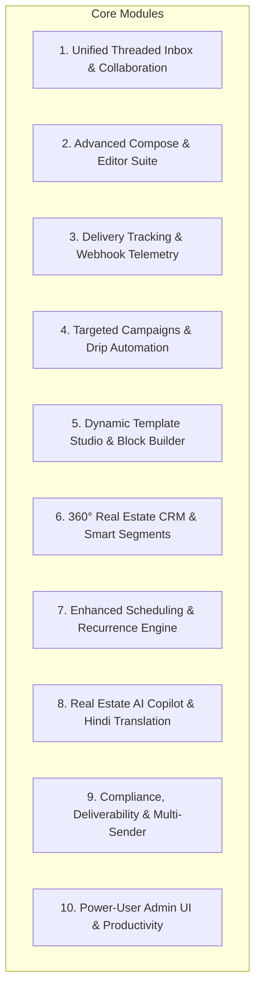
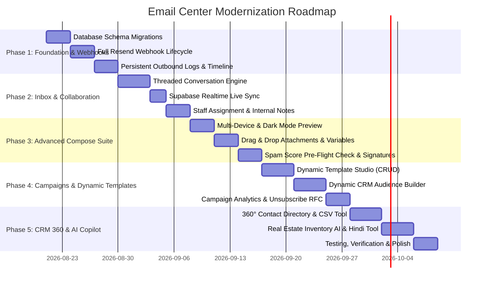

# Email Center Improvement & Feature Roadmap Plan

**SVI Infra Solutions — Admin Email Center Modernization**

---

## 1. Executive Summary & Current State vs. Target State

The **Email Center** in SVI Infra Solutions currently provides essential foundational functionality:

- Sending individual emails via Resend API (`POST /api/admin/email`)
- Basic rich text editing with TipTap (`RichTextEditor.tsx`)
- Inbound email sync via Resend receiving API & webhook (`email_inbox` table)
- Hardcoded static templates from JSON (`src/data/email-templates.json`)
- Basic scheduling in `scheduled_emails` table processed by cron
- Basic campaigns sent to `'all_users' | 'lottery_participants' | 'custom'`
- Simple recycle bin / deletion tracking (`email_deletions`)
- Elementary AI generation via Groq

### Key Gaps Identified in Existing Implementation:

| Area                            | Current Implementation                                                                          | Target Production State                                                                                                                                                       |
| :------------------------------ | :---------------------------------------------------------------------------------------------- | :---------------------------------------------------------------------------------------------------------------------------------------------------------------------------- |
| **Inbound / Inbox**             | Flat list of received emails, 30s polling, no thread view, ignores open/click/delivery webhooks | True multi-turn conversation threading, Supabase Realtime live sync, read/unread states, staff assignment & internal team notes                                               |
| **Outbound Tracking**           | Sent list pulled live from `resend.emails.list()` (capped at 100, not indexed in DB)            | Dedicated `email_messages` table storing every outbound message, full timeline events (Delivered $\to$ Opened $\to$ Clicked $\to$ Bounced), retry actions                     |
| **Campaigns**                   | Hardcoded 3 recipient options, no group selector, no campaign performance analytics             | Visual dynamic audience segmenter (pulling CRM leads, site visits, lottery, BBA, registrations), campaign analytics (Open %, CTR, Click Maps), RFC 8058 One-Click Unsubscribe |
| **Templates**                   | Static JSON file, read-only for admins                                                          | Dynamic Supabase-backed Template Studio with CRUD, category tagging, variable inserter pills, visual block components for real estate                                         |
| **Compose Suite**               | Basic editor without drag-drop file upload, no multi-device preview, no test send               | Drag & drop inline images, Responsive Preview (Desktop/Tablet/Mobile/Dark Mode), Deliverability & Spam Score pre-flight checker, Signature Switcher, Test Send modal          |
| **CRM Integration**             | Contacts fetched only from `profiles` with `real_email`                                         | Unified 360° Contact Directory aggregating `registrations`, `chat_leads`, `site_visits`, `allotment_records`, `whatsapp_contacts` with CSV import/export                      |
| **Scheduling**                  | Queue-only, cannot edit or reschedule pending items                                             | Full edit/reschedule capability, recurring schedules (weekly newsletters, monthly payment statements), smart send-time AI                                                     |
| **AI Copilot**                  | Generic text completions                                                                        | Real estate inventory-aware auto-reply generator, English $\leftrightarrow$ Hindi translation, Subject line optimization & spam scoring                                       |
| **Deliverability & Compliance** | Single sender, no suppression list, basic DNS checks                                            | Multi-mailbox switching (`sales@`, `support@`, `billing@`), Bounce & Complaint suppression blacklist, CAN-SPAM & Indian DPDP Act compliance                                   |

---

## 2. Comprehensive Missing Features Breakdown (10 Core Modules)



---

## 2. Feature Implementation Status Matrix

| Module                            | Feature                                                                                            | Status           |
| :-------------------------------- | :------------------------------------------------------------------------------------------------- | :--------------- |
| **Module 1: Inbox**               | 1.1 True Two-Way Conversation Threading                                                            | ⏳ Pending       |
|                                   | 1.2 Real-time Live Sync (Supabase Realtime)                                                        | ⏳ Pending       |
|                                   | **1.3 Read / Unread / Starred / Archive State & Bulk Actions**                                     | **✅ Completed** |
|                                   | 1.4 Staff Assignment & Routing                                                                     | ⏳ Pending       |
|                                   | 1.5 Private Internal Notes & Collaboration                                                         | ⏳ Pending       |
|                                   | 1.6 Thread Status & SLA Management                                                                 | ⏳ Pending       |
| **Module 2: Compose**             | 2.1 Drag & Drop Inline Images & File Attachments                                                   | ⏳ Pending       |
|                                   | 2.2 Multi-Device & Dark Mode Previewer                                                             | ⏳ Pending       |
|                                   | 2.3 Deliverability & Spam Score Pre-Flight Check                                                   | ⏳ Pending       |
|                                   | 2.4 Interactive Variable Inserter & Autocomplete Pills                                             | ⏳ Pending       |
|                                   | 2.5 HTML Source Code View with Syntax Highlighting                                                 | ⏳ Pending       |
|                                   | 2.6 Send Test Email Modal                                                                          | ⏳ Pending       |
|                                   | 2.7 Multi-Signature Manager                                                                        | ⏳ Pending       |
|                                   | 2.8 Auto-Save & Cloud Recovery Status Indicator                                                    | ⏳ Pending       |
| **Module 3: Outbound & Webhooks** | **3.1 Full Resend Webhook Processing (`delivered`, `opened`, `clicked`, `bounced`, `complained`)** | **✅ Completed** |
|                                   | 3.2 Persistent Outbound Table (`email_messages`)                                                   | ⏳ Pending       |
|                                   | 3.3 Visual Email Audit Timeline                                                                    | ⏳ Pending       |
|                                   | **3.4 1-Click Failed Delivery Retry / Resend**                                                     | **✅ Completed** |
| **Module 4: Campaigns**           | 4.1 Dynamic Real Estate Audience Segmenter                                                         | ⏳ Pending       |
|                                   | 4.2 Campaign Performance Analytics Dashboard (Open %, CTR, Click Map)                              | ⏳ Pending       |
|                                   | 4.3 RFC 8058 One-Click Unsubscribe & Compliance Engine                                             | ⏳ Pending       |
|                                   | 4.4 A/B Subject Line & Content Testing                                                             | ⏳ Pending       |
|                                   | 4.5 Drip Marketing Sequences (Automated Workflows)                                                 | ⏳ Pending       |
| **Module 5: Templates**           | 5.1 Full Database-Backed Template Studio (CRUD)                                                    | ⏳ Pending       |
|                                   | 5.2 Modular Real Estate Email Component Blocks                                                     | ⏳ Pending       |
|                                   | 5.3 Real Estate Specific Pre-Built Templates                                                       | ⏳ Pending       |
|                                   | 5.4 Template Versioning & Rollback                                                                 | ⏳ Pending       |
| **Module 6: CRM 360°**            | 6.1 Unified Multi-Source Contact Directory                                                         | ⏳ Pending       |
|                                   | 6.2 CSV / Excel Contact Import & Export                                                            | ⏳ Pending       |
|                                   | 6.3 Contact 360° Communication History Drawer                                                      | ⏳ Pending       |
| **Module 7: Scheduling**          | 7.1 Edit / Reschedule Queued Emails & Immediate Send                                               | ⏳ Pending       |
|                                   | 7.2 Recurring Email Automation (Weekly/Monthly)                                                    | ⏳ Pending       |
|                                   | 7.3 Optimal Send-Time AI Recommendation                                                            | ⏳ Pending       |
| **Module 8: AI Copilot**          | 8.1 Inventory & Catalog Aware Auto-Reply Generator                                                 | ⏳ Pending       |
|                                   | 8.2 Bilingual 1-Click Translation (English $\longleftrightarrow$ Hindi)                            | ⏳ Pending       |
|                                   | 8.3 Subject Line Scorer & Headline Suggestions                                                     | ⏳ Pending       |
|                                   | 8.4 Smart Follow-up Trigger for Inactive Leads                                                     | ⏳ Pending       |
| **Module 9: Compliance**          | 9.1 Multi-Sender Mailbox Switcher (`sales@`, `support@`, `billing@`)                               | ⏳ Pending       |
|                                   | 9.2 Email Suppression & Blacklist Manager                                                          | ⏳ Pending       |
|                                   | 9.3 Admin Audit Trail & Access Logs                                                                | ⏳ Pending       |
| **Module 10: UX & Productivity**  | 10.1 Gmail-Style Keyboard Shortcuts (`c`, `e`, `#`, `s`, `r`, `f`, `j`/`k`, `/`)                   | ⏳ Pending       |
|                                   | 10.2 Attachment Lightbox Previewer (PDF & Images)                                                  | ⏳ Pending       |
|                                   | 10.3 Clean Email Export & Print to PDF                                                             | ⏳ Pending       |
|                                   | 10.4 Advanced Search Filter Syntax (`from:`, `has:attachment`, etc.)                               | ⏳ Pending       |

---

### Module 1: Unified Threaded Inbox & Team Collaboration

1. **True Two-Way Conversation Threading:** `[PENDING]`
   - Group inbound replies and outbound replies into unified message threads using `In-Reply-To`, `References`, and matching subject hashes.
   - Display chronological chat/email bubbles showing both client inquiries and admin responses in one seamless thread view.
2. **Real-time Live Sync (Supabase Realtime):** `[PENDING]`
   - Replace 30-second polling with WebSocket subscriptions on the `email_inbox` and `email_messages` tables.
   - Instant unread badge updates and audio/toast notification when a new client email arrives.
3. **Read / Unread / Starred / Archive State Management:** `[COMPLETED ✅]`
   - **Applied & Delivered:**
     - Database migration: `supabase/migrations/20260820000001_add_read_archive_tags_to_email_inbox.sql` adding `is_read`, `is_archived`, `is_starred`, `tags` and composite indexes.
     - Backend API routes: `GET /api/admin/email?action=inbox` supporting `filter=inbox|unread|starred|archived|all`, `tag`, `search`, and `action=inbox_detail` auto-mark read.
     - Backend POST handlers: `action: 'mark_read'`, `action: 'mark_unread'`, `action: 'mark_all_read'`, `action: 'archive'`, `action: 'unarchive'`, `action: 'apply_tags'`, `action: 'bulk_star'`, and enhanced `star`/`unstar`.
     - Frontend UI (`RepliesTab.tsx`):
       - Multi-select checkboxes per row + header select-all checkbox with indeterminate state.
       - Floating/Top Bulk Action Bar with "Mark as Read", "Mark as Unread", "Archive selected", "Move to Trash", "Apply Tag" popover, and "Clear Selection".
       - Header "Mark all read" button.
       - Filter views (`Inbox`, `Unread`, `Starred`, `Archived`, `All`) and Tag filter dropdown.
       - Color-coded tag pills on email rows and interactive tag management (+ Add Tag / remove) in `EmailDetailPanel.tsx`.
4. **Staff Assignment & Routing:** `[PENDING]`
   - Assign email threads to specific sales executives or advisors (linked to `employees` / `profiles`).
   - Filter inbox by "Assigned to Me", "Unassigned", or "All Team".
5. **Private Internal Notes & Collaboration:** `[PENDING]`
   - Internal staff can post private notes inside an email thread (visible only to admins, not sent to the client).
   - Tag other team members with `@mention` notifications to discuss client inquiries before replying.
6. **Thread Status & SLA Management:** `[PENDING]`
   - Status tags: `New` $\to$ `In Progress` $\to$ `Waiting on Client` $\to$ `Resolved` $\to$ `Closed`.
   - Overdue SLA warning indicators for inquiries unanswered for $> 24$ hours.

---

### Module 2: Advanced Compose & Rich Editor Suite

1. **Drag & Drop Inline Images & File Attachments:**
   - Direct drag-and-drop file upload into the TipTap editor or attachment dropzone.
   - Automatic upload to Supabase Storage (`email-attachments` bucket) with thumbnail generation and size formatting.
2. **Multi-Device Responsive Preview & Dark Mode Checker:**
   - Viewport toggle inside Compose modal: **Desktop (600px+)**, **Tablet (768px)**, and **Mobile (375px)**.
   - **Dark Mode Simulation**: Previews how email colors, logos, and contrast render in Dark Mode email clients (Apple Mail, Outlook Dark, Gmail Dark).
3. **Deliverability & Spam Score Pre-Flight Check:**
   - Pre-send validation engine analyzing:
     - Spam trigger words (e.g., "100% FREE", "GUARANTEED RETURN", "ACT NOW").
     - High image-to-text ratio warning.
     - Missing contact footer / physical office address.
     - Unsubscribe link presence for broadcast emails.
     - Domain DNS alignment (SPF/DKIM/DMARC status).
4. **Interactive Variable Inserter & Autocomplete Pills:**
   - Typing `{{` in TipTap triggers a dynamic variable menu:
     - `{{client_name}}`, `{{property_name}}`, `{{plot_no}}`, `{{bba_number}}`, `{{payment_due}}`, `{{advisor_name}}`, `{{advisor_phone}}`.
   - Highlighted pill tags in the editor that validate whether recipient records contain required fields.
5. **HTML Source Code View with Syntax Highlighting:**
   - Dual-mode switch: Rich Visual Editor $\longleftrightarrow$ Raw HTML Code Editor (with formatting & tag validation) for custom corporate layouts.
6. **Send Test Email Modal:**
   - Send an immediate sample test to the logged-in admin or custom test address with sample merged variable data before dispatching to real clients.
7. **Email Signature Manager:**
   - Switch between multiple saved signatures:
     - Corporate Official Signature (with company logo, RERA number, address, website link).
     - Personal Advisor Signature (Advisor photo, direct phone, WhatsApp QR link).
     - Minimal Text Signature.
8. **Auto-Save & Cloud Recovery Status:**
   - Real-time auto-save indicator: _"Draft saved to cloud 2s ago"_ with version history and discard option.

---

### Module 3: Full Lifecycle Delivery Tracking & Webhook Ingestion

1. **Comprehensive Resend Webhook Processing:** `[COMPLETED ✅]`
   - **Applied & Delivered:**
     - Expanded `app/api/webhooks/resend/incoming/route.ts` with full lifecycle event ingestion:
       - `email.sent` — creates/updates outbound tracking row in `email_messages`.
       - `email.delivered` — records `delivered_at` timestamp and advances status.
       - `email.opened` — increments `open_count`, records `first_opened_at`, logs IP and user-agent/device (`client.name / os / device`).
       - `email.clicked` — increments `click_count`, records `first_clicked_at`, logs the exact clicked URL per event.
       - `email.bounced` — logs `bounce_type` (hard vs. soft) and `bounce_reason`; **hard bounces automatically suppress the recipient** in `email_suppressions`.
       - `email.complained` — flags the message `complained_at` and **automatically suppresses the recipient** from all future mail.
     - Event deduplication via unique `idempotency_key` on `email_events` (click URLs included in the key) — duplicate webhook deliveries are acknowledged and skipped.
     - Immutable audit log: every event persisted to `email_events` (type, timestamp, IP, user-agent, URL, bounce details, raw payload).
     - Aggregate tracking: `email_messages` upserted per Resend ID with status precedence `complained > bounced > clicked > opened > delivered > sent`.
     - New database migration `20260821120000_create_email_events_and_messages.sql`:
       - `email_messages` — per-outbound aggregated delivery tracking (open/click counts, event timestamps).
       - `email_events` — idempotent lifecycle audit log.
       - `email_suppressions` — hard-bounce / complaint suppression list (unique by email).
       - RLS: service-role full access, admin JWT access via `is_admin()`, anon denied + revoked.
2. **Persistent Outbound Email Table (`email_messages`):**
   - Store complete outbound email records in Supabase (Sender, Recipient list, Subject, Body HTML snippet, Resend ID, Status, Metadata).
   - Fast server-side search, pagination, and date filtering without hitting external API rate limits.
3. **Visual Email Audit Timeline:**
   - In the email detail view, display a visual step-by-step audit trail:
     - `[10:00 AM] Sent via Resend API`
     - `[10:01 AM] Delivered to mail server (250 OK)`
     - `[10:14 AM] Opened on iOS / Apple Mail`
     - `[10:15 AM] Clicked "View Plot Layout" link`
4. **1-Click Retry / Resend for Failed Deliveries:** `[COMPLETED ✅]`
   - **Applied & Delivered:**
     - Added backend retry endpoints in `app/api/admin/email/route.ts`:
       - `action: 'retry_send'` — Fetches original message payload and attachments from Resend/database, supports custom recipient overrides, and re-dispatches immediately.
       - `action: 'retry_scheduled'` — Re-dispatches failed scheduled emails immediately and marks them as sent upon success.
       - `action: 'bulk_retry_failed'` — Batches retry attempts for multiple failed messages.
     - Enhanced `EmailDetailPanel.tsx` with:
       - Dedicated **"Delivery Failed / Bounced" Alert Banner** displaying bounce status and diagnostic advice.
       - Primary **"1-Click Retry Now"** button with dynamic spinner state.
       - **"Resend to Alternative Email"** toggle allowing address corrections before resending.
     - Enhanced `SentTab.tsx` & `EmailListItem.tsx`:
       - Direct "Retry Send" button on failed/bounced rows.
       - Context menu item for quick retry.
     - Enhanced `ScheduledTab.tsx` & `useScheduledEmails.ts`:
       - Status filter tabs (`All`, `Pending`, `Failed` with badge count, `Sent`).
       - Prominent 1-click retry button for failed scheduled items.
       - Immediate "Send Now" button for pending scheduled items.

---

### Module 4: Targeted Campaigns, Segmentation & Automation

1. **Dynamic Real Estate Audience Builder:**
   - Expand campaign targeting beyond static options to include dynamic CRM segments:
     - **By Project Interest:** _Shivani Vatika-11_, _Plots in Sector 65_, _Commercial Projects_.
     - **By Customer Lifecycle:** _New Registrations_, _Site Visit Completed_, _Quotation Generated_, _Allotment Issued_, _BBA Pending_.
     - **By Custom Contact Groups:** Select one or multiple user-created contact groups.
     - **By Activity / Engagement:** _Opened an email in last 30 days_, _Inactive leads $> 60$ days_.
2. **Campaign Performance Analytics Dashboard:**
   - Visual KPI cards: Total Sent, Delivery Rate %, Open Rate %, Click-Through Rate (CTR) %, Bounce Rate %, Unsubscribe Count.
   - **Click Map & Link Analytics:** Table and visual bar chart showing which specific links inside the campaign email received the most clicks.
   - **Device & Client Breakdown:** Percentage of recipients opening on Mobile vs. Desktop vs. Tablet.
3. **RFC 8058 One-Click Unsubscribe & Compliance Engine:**
   - Automated injection of `List-Unsubscribe` and `List-Unsubscribe-Post` headers.
   - Customizable branded Unsubscribe confirmation page and preference center (e.g. opt-out from marketing but keep transaction/payment receipts).
   - Automatic suppression of unsubscribed addresses from future campaigns.
4. **A/B Subject Line & Content Testing:**
   - Send Subject Variant A to 15% and Subject Variant B to 15%.
   - After a designated testing window (e.g. 2 hours), automatically dispatch the winning variant (highest open rate) to the remaining 70%.
5. **Drip Marketing Sequences (Automated Workflows):**
   - Multi-step automated nurture campaigns triggered on key lifecycle events:
     - _Trigger: New Registration_ $\to$ Day 1: Welcome & Masterplan PDF $\to$ Day 3: Video Tour & Customer Testimonials $\to$ Day 7: Book Free Site Visit $\to$ Day 14: Limited-Time Festive Discount.

---

### Module 5: Dynamic Template Studio & Modular Block Builder

1. **Full Database-Backed Template Management (CRUD):**
   - Move from static `email-templates.json` to a dynamic `email_templates` database table.
   - Admins can create new templates, edit existing ones, clone, categorize, and delete them from the UI.
2. **Modular Real Estate Email Component Blocks:**
   - Ready-to-use visual building blocks that admins can insert with 1 click:
     - **Brand Hero Header:** SVI corporate logo with custom gold badge.
     - **Property Showcase Card:** Image, project title, price from ₹X Lakhs, location pin, and "Book Site Visit" CTA.
     - **Payment Breakdown Table:** Milestone, amount, due date, status badge.
     - **Agent / Advisor Contact Card:** Photo, name, direct phone, WhatsApp button.
     - **Google Maps & Directions Block:** Map preview with 1-click navigation link to site office.
     - **Legal & Corporate Footer:** RERA registration number, office address, copyright, social icons, unsubscribe link.
3. **Real Estate Specific Pre-Built Templates:**
   - _Site Visit Booking Confirmation & Site Directions_
   - _Construction Milestones & Live Site Photo Updates_
   - _Price Revision & Pre-Launch Offer Announcement_
   - _Payment Overdue & Final Legal Demand Notice_
   - _Diwali / New Year Exclusive Festive Scheme_
   - _Possession Handover & Key Handover Ceremony Invite_
   - _Referral Bonus Program for Existing Allottees_
4. **Template Versioning & Rollback:**
   - Automatic change history tracking for templates to prevent accidental overwrites.

---

### Module 6: 360° Real Estate CRM & Contact Directory

1. **Unified Multi-Source Contact Directory:**
   - Centralized contact engine consolidating data from all platform touchpoints:
     - User Profiles (`profiles`)
     - Website Registrations (`registrations`)
     - Chatbot Leads (`chat_leads`)
     - Site Visit Bookings (`site_visits`)
     - WhatsApp Contacts (`whatsapp_contacts`)
     - Quotation, Allotment & BBA Records (`allotment_records`, `bba_records`, `quotation_records`)
2. **CSV / Excel Contact Import & Export:**
   - Bulk upload contacts via CSV/Excel with column mapping (Full Name, Email, Phone, Project, Source, Notes).
   - Duplicate detection (by email and phone number) with choose-to-merge or skip options.
   - Export filtered segments to Excel (`.xlsx`) or CSV.
3. **Contact 360° Communication History View:**
   - Clicking a contact opens their full activity drawer:
     - Chronological timeline of all emails sent to/received from them.
     - Associated WhatsApp conversations.
     - Scheduled/completed site visits.
     - Registered properties and payment receipts.

---

### Module 7: Enhanced Scheduling & Recurrence Engine

1. **Full Scheduled Email Management (Edit / Reschedule / Cancel):**
   - Edit subject, body, recipients, or scheduled time of any queued email before its execution.
   - Immediate "Send Now" override for pending scheduled emails.
2. **Recurring Email Automation:**
   - Set up scheduled emails on a recurring basis (e.g. _Every 1st of the month: Payment Statement_, _Every Friday: Weekly Construction Digest_).
3. **Optimal Send-Time Recommendation (AI-Assisted):**
   - Suggests the optimal send time based on historical open rates for real estate audiences in India (e.g. Tuesdays/Thursdays 10:30 AM IST or 6:30 PM IST).

---

### Module 8: Real Estate AI Copilot & Hindi Translation

1. **Inventory & Knowledge Base Aware Auto-Reply:**
   - When a client asks: _"What is the current rate for 100 sq yd plot in Shivani Vatika-11 and is bank loan available?"_
   - The AI Assistant analyzes the live property catalog, bank approvals, and pricing data to generate a factual, professional reply for admin review.
2. **1-Click Bilingual Translation (English $\longleftrightarrow$ Hindi):**
   - Seamlessly translate email drafts between English and Hindi, maintaining formal real estate vocabulary and proper honorifics (_श्री / महोदय / सादर प्रणाम_).
3. **Subject Line Scorer & High-Converting Headline Suggestions:**
   - Generate 5 variation choices for any email (e.g. Urgent, Professional, Value-focused, Festive) with an engagement score ($1-100$) and spam risk check.
4. **Smart Follow-up Trigger:**
   - Automatically detect unanswered inquiries or quote follow-ups and generate polite re-engagement emails (_"Just checking in regarding your visit to Shivani Vatika..."_).

---

### Module 9: Compliance, Deliverability & Multi-Sender Governance

1. **Multi-Sender Mailbox Switcher:**
   - Allow admins to choose the sender identity for each email:
     - `info@sviiinfrasolutions.com` (General Inquiries)
     - `sales@sviiinfrasolutions.com` (Sales & Project Details)
     - `support@sviiinfrasolutions.com` (Grievances & Customer Care)
     - `billing@sviiinfrasolutions.com` (Payment Receipts & Demands)
     - `hr@sviiinfrasolutions.com` (Career & Internal)
2. **Email Suppression & Blacklist Manager:**
   - Dedicated tab to view and manage hard bounces, spam complaints, and unsubscribed addresses.
   - Prevent accidental delivery to bad or complained email addresses, protecting domain reputation.
3. **Audit Trail & Admin Access Logs:**
   - Log all administrative email actions: Campaign Dispatched, Mass Delete, Contact Export, API Key Modification.

---

### Module 10: Power-User Admin UI & Productivity

1. **Gmail-Style Keyboard Shortcuts:**
   - `c`: Open Compose
   - `e`: Archive Thread
   - `#` / `Delete`: Move to Trash
   - `s`: Star / Unstar
   - `r`: Reply to current email
   - `f`: Forward current email
   - `j` / `k`: Next / Previous email in list
   - `/`: Focus search bar
2. **Attachment Lightbox Previewer:**
   - In-app preview modal for PDF documents, project brochures, payment receipts, and images without forcing file downloads.
3. **Email Export & Print Formatting:**
   - Clean "Print to PDF" or export formatted `.pdf` / `.eml` for official corporate records and legal correspondence.
4. **Search Filter Syntax:**
   - Support structured search tokens in the search bar: `from:rahul@`, `to:advisor@`, `has:attachment`, `is:unread`, `project:shivani`, `status:bounced`.

---

## 3. Database Schema Architecture (Supabase / PostgreSQL)

Below is the complete database schema design required to support all missing features:

```sql
-- ============================================================================
-- 1. UNIFIED OUTBOUND EMAIL LOGS
-- ============================================================================
CREATE TABLE IF NOT EXISTS email_messages (
    id UUID PRIMARY KEY DEFAULT gen_random_uuid(),
    resend_id VARCHAR(100) UNIQUE,
    thread_id UUID,
    from_email VARCHAR(255) NOT NULL,
    from_name VARCHAR(255),
    to_emails TEXT[] NOT NULL,
    cc_emails TEXT[],
    bcc_emails TEXT[],
    reply_to VARCHAR(255),
    subject TEXT NOT NULL,
    html_content TEXT,
    text_content TEXT,
    snippet TEXT,
    status VARCHAR(50) DEFAULT 'sent', -- sent, delivered, opened, clicked, bounced, complained, failed
    delivery_status_details JSONB DEFAULT '{}'::jsonb,
    opened_count INT DEFAULT 0,
    first_opened_at TIMESTAMPTZ,
    last_opened_at TIMESTAMPTZ,
    clicked_count INT DEFAULT 0,
    last_clicked_at TIMESTAMPTZ,
    bounced_at TIMESTAMPTZ,
    bounce_reason TEXT,
    is_starred BOOLEAN DEFAULT FALSE,
    is_archived BOOLEAN DEFAULT FALSE,
    campaign_id UUID,
    created_by UUID REFERENCES profiles(id) ON DELETE SET NULL,
    created_at TIMESTAMPTZ DEFAULT NOW(),
    updated_at TIMESTAMPTZ DEFAULT NOW()
);

CREATE INDEX IF NOT EXISTS idx_email_messages_resend_id ON email_messages(resend_id);
CREATE INDEX IF NOT EXISTS idx_email_messages_thread_id ON email_messages(thread_id);
CREATE INDEX IF NOT EXISTS idx_email_messages_status ON email_messages(status);
CREATE INDEX IF NOT EXISTS idx_email_messages_created_at ON email_messages(created_at DESC);

-- ============================================================================
-- 2. EMAIL THREADS & CONVERSATION COLLABORATION
-- ============================================================================
CREATE TABLE IF NOT EXISTS email_threads (
    id UUID PRIMARY KEY DEFAULT gen_random_uuid(),
    subject TEXT NOT NULL,
    normalized_subject TEXT NOT NULL, -- Subject stripped of Re:, Fwd: for grouping
    contact_email VARCHAR(255) NOT NULL,
    contact_name VARCHAR(255),
    assigned_to UUID REFERENCES profiles(id) ON DELETE SET NULL,
    status VARCHAR(50) DEFAULT 'new', -- new, in_progress, waiting_client, resolved, closed
    is_read BOOLEAN DEFAULT FALSE,
    is_starred BOOLEAN DEFAULT FALSE,
    is_archived BOOLEAN DEFAULT FALSE,
    tags TEXT[] DEFAULT '{}',
    message_count INT DEFAULT 1,
    last_message_at TIMESTAMPTZ DEFAULT NOW(),
    created_at TIMESTAMPTZ DEFAULT NOW(),
    updated_at TIMESTAMPTZ DEFAULT NOW()
);

CREATE INDEX IF NOT EXISTS idx_email_threads_contact_email ON email_threads(contact_email);
CREATE INDEX IF NOT EXISTS idx_email_threads_assigned_to ON email_threads(assigned_to);
CREATE INDEX IF NOT EXISTS idx_email_threads_last_message ON email_threads(last_message_at DESC);

-- Internal Private Staff Notes on Email Threads
CREATE TABLE IF NOT EXISTS email_thread_notes (
    id UUID PRIMARY KEY DEFAULT gen_random_uuid(),
    thread_id UUID NOT NULL REFERENCES email_threads(id) ON DELETE CASCADE,
    author_id UUID NOT NULL REFERENCES profiles(id) ON DELETE CASCADE,
    note TEXT NOT NULL,
    created_at TIMESTAMPTZ DEFAULT NOW()
);

-- ============================================================================
-- 3. DYNAMIC EMAIL TEMPLATES STUDIO
-- ============================================================================
CREATE TABLE IF NOT EXISTS email_templates (
    id UUID PRIMARY KEY DEFAULT gen_random_uuid(),
    slug VARCHAR(100) UNIQUE NOT NULL,
    name VARCHAR(255) NOT NULL,
    category VARCHAR(100) NOT NULL DEFAULT 'General',
    subject TEXT NOT NULL,
    html_content TEXT NOT NULL,
    preview_text VARCHAR(255),
    icon_name VARCHAR(50) DEFAULT 'FileText',
    available_variables JSONB DEFAULT '[]'::jsonb, -- e.g. [{"name": "client_name", "description": "Full name of buyer"}]
    is_system_template BOOLEAN DEFAULT FALSE,
    created_by UUID REFERENCES profiles(id) ON DELETE SET NULL,
    created_at TIMESTAMPTZ DEFAULT NOW(),
    updated_at TIMESTAMPTZ DEFAULT NOW()
);

CREATE INDEX IF NOT EXISTS idx_email_templates_category ON email_templates(category);

-- ============================================================================
-- 4. EMAIL CAMPAIGN TELEMETRY & ANALYTICS
-- ============================================================================
CREATE TABLE IF NOT EXISTS email_campaign_recipients (
    id UUID PRIMARY KEY DEFAULT gen_random_uuid(),
    campaign_id UUID NOT NULL REFERENCES email_campaigns(id) ON DELETE CASCADE,
    email VARCHAR(255) NOT NULL,
    name VARCHAR(255),
    resend_id VARCHAR(100),
    status VARCHAR(50) DEFAULT 'pending', -- pending, sent, delivered, opened, clicked, bounced, unsubscribed
    opened_at TIMESTAMPTZ,
    clicked_at TIMESTAMPTZ,
    clicked_links TEXT[] DEFAULT '{}',
    bounced_at TIMESTAMPTZ,
    error_message TEXT,
    created_at TIMESTAMPTZ DEFAULT NOW()
);

CREATE INDEX IF NOT EXISTS idx_campaign_recipients_campaign ON email_campaign_recipients(campaign_id);
CREATE INDEX IF NOT EXISTS idx_campaign_recipients_email ON email_campaign_recipients(email);

-- ============================================================================
-- 5. COMPLIANCE & SUPPRESSION LIST (UNSUBSCRIBE / BOUNCE / SPAM)
-- ============================================================================
CREATE TABLE IF NOT EXISTS email_suppression_list (
    id UUID PRIMARY KEY DEFAULT gen_random_uuid(),
    email VARCHAR(255) UNIQUE NOT NULL,
    reason VARCHAR(50) NOT NULL, -- unsubscribe, hard_bounce, spam_complaint, manual_block
    source_campaign_id UUID REFERENCES email_campaigns(id) ON DELETE SET NULL,
    notes TEXT,
    created_at TIMESTAMPTZ DEFAULT NOW()
);

CREATE INDEX IF NOT EXISTS idx_suppression_email ON email_suppression_list(email);

-- ============================================================================
-- 6. SAVED EMAIL SIGNATURES
-- ============================================================================
CREATE TABLE IF NOT EXISTS email_signatures (
    id UUID PRIMARY KEY DEFAULT gen_random_uuid(),
    user_id UUID REFERENCES profiles(id) ON DELETE CASCADE,
    title VARCHAR(100) NOT NULL,
    is_default BOOLEAN DEFAULT FALSE,
    html_content TEXT NOT NULL,
    created_at TIMESTAMPTZ DEFAULT NOW(),
    updated_at TIMESTAMPTZ DEFAULT NOW()
);
```

---

## 4. API Route Architecture & Endpoints

```
app/api/
├── admin/
│   ├── email/
│   │   ├── route.ts                     # Enhanced: GET, POST (Send, Star, Tag, Assign, Batch)
│   │   ├── ai/
│   │   │   └── route.ts                 # Enhanced: Inventory-aware replies, translation, subject scorer
│   │   ├── messages/
│   │   │   ├── route.ts                 # NEW: Paginated search on email_messages
│   │   │   └── [id]/
│   │   │       ├── route.ts             # NEW: Message detail, resend retry, timeline events
│   │   │       └── retry/route.ts       # NEW: 1-click retry failed outbound email
│   │   ├── threads/
│   │   │   ├── route.ts                 # NEW: List & filter conversation threads
│   │   │   └── [id]/
│   │   │       ├── route.ts             # NEW: Thread conversation history & status update
│   │   │       └── notes/route.ts       # NEW: Internal team private notes CRUD
│   │   ├── templates/
│   │   │   ├── route.ts                 # NEW: Dynamic Template CRUD (GET, POST)
│   │   │   └── [id]/route.ts            # NEW: Template update, clone, delete (GET, PUT, DELETE)
│   │   ├── signatures/
│   │   │   └── route.ts                 # NEW: Signatures CRUD & default selector
│   │   ├── suppression/
│   │   │   └── route.ts                 # NEW: Manage unsubscribed & bounced blacklist
│   │   └── preflight-check/
│   │       └── route.ts                 # NEW: Deliverability & spam score analyzer
│   ├── campaigns/
│   │   ├── route.ts                     # Enhanced: Advanced campaign creation with segments
│   │   ├── [id]/
│   │   │   ├── route.ts                 # Campaign detail & edit
│   │   │   ├── send/route.ts            # Immediate send with batching & suppression check
│   │   │   └── analytics/route.ts       # NEW: Detailed Open/CTR/Click map telemetry
│   │   └── ab-test/route.ts             # NEW: A/B test setup & automated winner dispatch
│   ├── contacts/
│   │   ├── route.ts                     # Enhanced: Multi-source CRM directory
│   │   ├── import/route.ts              # NEW: CSV/Excel bulk import with column mapper
│   │   ├── export/route.ts              # NEW: Excel/CSV export of filtered segments
│   │   └── [id]/360/route.ts            # NEW: 360° lead communication history
├── unsubscribe/
│   └── route.ts                         # NEW: Public RFC 8058 One-Click Unsubscribe Handler
└── webhooks/
    └── resend/
        └── incoming/
            └── route.ts                 # Enhanced: Handles received, delivered, opened, clicked, bounced
```

---

## 5. UI Component Architecture & File Layout

```
src/components/admin/email/
├── AdminEmailPage.tsx                   # Master Container with Keyboard Shortcuts & Realtime Listener
├── types.ts                             # Comprehensive TypeScript Interfaces
├── constants.ts                         # Static Constants, Shortcuts, Navigation Config
├── helpers.ts                           # Text Cleaners, Formatters, Mime Handlers, Date Formatters
│
├── tabs/
│   ├── InboxTab.tsx                     # Enhanced Threaded Inbox with Realtime & Staff Filters
│   ├── SentTab.tsx                      # Enhanced Outbound Logs with Full Timeline & Retry
│   ├── ComposeTab.tsx                   # Advanced Multi-Mode Composer
│   ├── DraftsTab.tsx                    # Enhanced Drafts with Versioning & Cloud Sync
│   ├── ScheduledTab.tsx                 # Enhanced Queue with Edit/Reschedule/Recurrence
│   ├── CampaignsTab.tsx                 # Campaign Manager with Live Telemetry & AB Testing
│   ├── TemplatesTab.tsx                 # Dynamic Template Studio (CRUD + Category Filter)
│   ├── ContactsTab.tsx                  # NEW: 360° Unified CRM Directory & CSV Importer
│   ├── SuppressionTab.tsx               # NEW: Unsubscribe & Bounce Blacklist Manager
│   ├── DomainsTab.tsx                   # Domain DNS & Authentication Health Monitor
│   ├── SettingsTab.tsx                  # Mailbox Switcher, Signatures & Delivery Settings
│   └── TrashTab.tsx                     # Deletions & Permanent Purge
│
├── compose/
│   ├── RichTextEditor.tsx               # TipTap with Drag-and-Drop & Variable Pill Autocomplete
│   ├── HTMLCodeEditor.tsx               # NEW: Syntax-highlighted HTML source view
│   ├── DevicePreviewModal.tsx           # NEW: Desktop / Tablet / Mobile / Dark Mode Simulator
│   ├── SpamScoreBadge.tsx               # NEW: Pre-flight deliverability meter & warning list
│   ├── SendTestModal.tsx                # NEW: Test email sender modal
│   ├── SignatureSelector.tsx            # NEW: Dropdown to insert/manage signatures
│   ├── VariablePickerPopover.tsx        # NEW: Dynamic tag inserter with descriptions
│   ├── AttachmentDropzone.tsx           # Enhanced: Direct drag & drop multi-file uploader
│   ├── AIComposePopover.tsx             # Inventory-aware smart prompt assistant
│   └── AIImprovePanel.tsx               # Tone, grammar, Hindi translation & length optimizer
│
├── thread/
│   ├── ThreadConversationView.tsx       # NEW: Chronological chat-style email bubble thread
│   ├── ThreadHeader.tsx                 # NEW: Subject, Status Badge, Assignee Dropdown, Tags
│   ├── ThreadActionToolbar.tsx          # NEW: Reply, Forward, Close, Mark Unread, Delete
│   ├── InternalNotesPanel.tsx           # NEW: Private staff collaboration comments
│   └── ContactProfileDrawer.tsx         # NEW: Right-side 360° CRM lead profile summary
│
├── campaigns/
│   ├── CampaignFormWizard.tsx           # Multi-step wizard (Audience -> Content -> Schedule -> Review)
│   ├── SegmentFilterBuilder.tsx         # NEW: Dynamic rule-based audience builder
│   ├── CampaignAnalyticsModal.tsx       # NEW: Charts, Open Rate %, CTR %, Click Map breakdown
│   ├── ABTestSetupCard.tsx              # NEW: Subject line split testing configuration
│   └── UnsubscribePreview.tsx           # NEW: Preview of footer unsubscribe link & headers
│
├── templates/
│   ├── TemplateEditorModal.tsx          # NEW: Create/Edit Template with live preview
│   ├── TemplateBlockLibrary.tsx         # NEW: Modular real estate UI blocks (Hero, Property, etc.)
│   └── TemplateCardGrid.tsx             # NEW: Visual template cards with category badges
│
└── common/
    ├── AttachmentPreviewModal.tsx       # NEW: In-app PDF and Image lightbox viewer
    ├── KeyboardShortcutsModal.tsx       # NEW: Cheat sheet modal for '?' keypress
    └── BulkActionBar.tsx                # Floating bar for mass actions on selected rows
```

---

## 6. Phased Implementation Roadmap



### Phase 1: Database Foundation, Webhook Telemetry & Outbound History

- **Deliverables:**
  1. Create database migrations for `email_messages`, `email_threads`, `email_templates`, `email_campaign_recipients`, `email_suppression_list`, `email_signatures`, and `email_thread_notes`.
  2. Upgrade `app/api/webhooks/resend/incoming/route.ts` to process `email.delivered`, `email.opened`, `email.clicked`, `email.bounced`, and `email.complained`.
  3. Store all outbound sends in `email_messages` and replace live Resend API polling in `SentTab` with fast indexed database queries.
  4. Build the Visual Email Audit Timeline component in the Sent email detail panel.

### Phase 2: Threaded Inbox, Realtime Sync & Staff Collaboration

- **Deliverables:**
  1. Group related emails into `email_threads` by `In-Reply-To` and normalized subjects.
  2. Implement Supabase Realtime subscription on `email_inbox` and `email_threads` for zero-refresh inbox updates.
  3. Add Read/Unread toggle, Starred, Archive, and Status tags (`New`, `In Progress`, `Resolved`).
  4. Build Staff Assignment dropdown and the Internal Private Notes drawer.

### Phase 3: Compose Modernization, Pre-Flight Deliverability & Signatures

- **Deliverables:**
  1. Build the Responsive Device Previewer (Desktop, Tablet, Mobile, and Dark Mode simulation).
  2. Implement direct Drag & Drop file attachment dropzone and inline image pasting.
  3. Add `{{variable}}` autocomplete pill injector inside TipTap.
  4. Create Spam Score & Deliverability Pre-Flight Checker with actionable warning tips.
  5. Add Multi-Signature Manager and Send Test Email modal.

### Phase 4: Dynamic Template Studio, Targeted Campaigns & Analytics

- **Deliverables:**
  1. Build the Template Studio UI with full CRUD, category filtering, and live preview rendering.
  2. Create modular real estate email blocks (Hero header, Property Card, Price table, Legal footer).
  3. Upgrade Campaigns tab with Dynamic Audience Builder (filtering CRM leads, registrations, site visits).
  4. Implement RFC 8058 One-Click Unsubscribe headers and Campaign Analytics Dashboard (Open rate, CTR, Click map).

### Phase 5: 360° Real Estate CRM Integration, AI Hindi Translation & Polish

- **Deliverables:**
  1. Build the Unified Contacts Tab with CSV/Excel import/export and duplicate detection.
  2. Create the Contact 360° Activity Drawer showing unified communication history.
  3. Implement AI Inventory-aware auto-replies and 1-click English $\longleftrightarrow$ Hindi translation.
  4. Implement Gmail-style keyboard shortcuts, attachment lightbox viewer, and search syntax filters.

---

## 7. Security, Compliance & Deliverability Rules

1. **RFC 8058 & CAN-SPAM Compliance:**
   - Every marketing email must automatically include:
     - `List-Unsubscribe: <https://www.sviinfrasolutions.com/api/unsubscribe?token=...>`
     - `List-Unsubscribe-Post: List-Unsubscribe=One-Click`
     - Physical company office address (`Block E-220, 2nd Floor, Sector 63 Noida, UP 201301`) in the footer.
2. **Indian Digital Personal Data Protection (DPDP) Act Compliance:**
   - Honor user consent and provide clear opt-out mechanisms.
   - Suppression list must immediately prevent any marketing communication to opted-out contacts.
3. **Webhook Verification (Fail-Closed):**
   - Resend inbound and telemetry webhooks must always verify the Svix signature (`svix-id`, `svix-timestamp`, `svix-signature`) using `RESEND_WEBHOOK_SECRET`.
4. **Role-Based Access Control (RLS):**
   - Admin access verification (`verifyAdmin`) on all endpoints.
   - Employee role scoping for staff assignment and private notes.
5. **Rate Limiting & Throttle Protection:**
   - Campaign batch sending throttled to max 50 emails per second to avoid hitting provider limits or triggering spam filters.

---

## 8. Verification & Acceptance Criteria

When implementing each module, verify using the following acceptance criteria:

1. **Inbound / Outbound Telemetry:**
   - Triggering a test send updates `email_messages` immediately.
   - Simulating Resend webhook events (`delivered`, `opened`, `clicked`) updates status and increments counters in real time.
2. **Threaded Inbox:**
   - Replying to an existing email groups the reply under the same thread ID.
   - Adding an internal note appears only in the admin UI and is never sent to the recipient.
3. **Template Studio:**
   - Creating a template in the admin UI persists in `email_templates` and immediately shows in the Template Picker during Compose.
4. **Campaign Segmentation:**
   - Selecting "Site Visits Completed" accurately queries the `site_visits` table and generates the exact recipient list without duplicates.
   - Unsubscribed addresses in `email_suppression_list` are automatically omitted from the final dispatch list.
5. **Responsive Preview & Pre-Flight:**
   - Compose preview accurately switches between Mobile (375px), Tablet (768px), and Desktop (600px+), with Dark Mode styles functioning cleanly.
